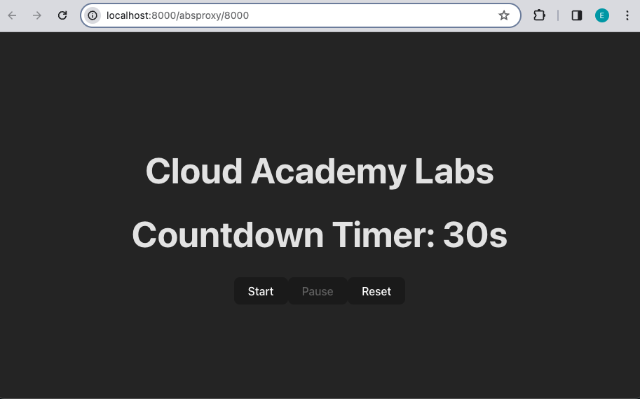
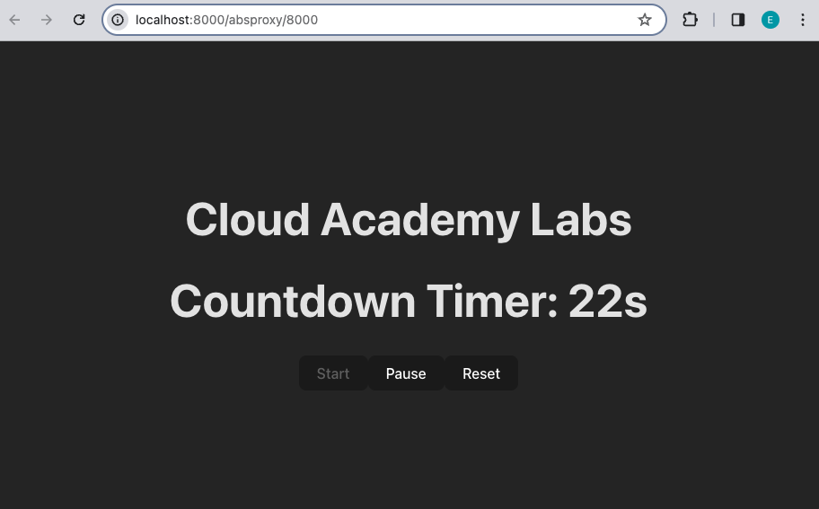

# Introduction to React Hooks - Custom Hooks

## Setup 
Before we begin writing code, let's setup the project and install all necesarry packages.
Open a new Terminal window and do the following steps:

1. Go to `calab` directory:
    ```
    cd calab
    ```
2. Install npm packages:
    ```
    npm install
    ```
3. Start the application:
    ```
    npm run dev
    ```
    You should see the development server being started:
    []() 

    If you open the `Local` URL in a new browser tab, you should see the follwoing:
    []()    


## Steps 

1. Create a new file for the custom hook
    -   Inside `calab/src`, create a new file named `useTimer.js`. This file will contain the code for the custom hook.
2. Import React and necessary hooks
    -   In the `useTimer.js` file, start by importing React and the necessary hooks (`useState` and `useEffect`) from React:
        ```
        import { useState, useEffect } from 'react';
        ```
3. Define the custom hook function
    -   Define the `useTimer` function, which will be our custom hook. It takes `initialSeconds` as a parameter and returns the timer's state and control functions:
    ```
    const useTimer = (initialSeconds) => {
        // Hook implementation goes here
    };
    ```
4. Implement the timer logic
    -   Inside the `useTimer` function, use `useState` to define state variables for `seconds` and `isActive`, which represent the remaining seconds and the timer's active status, respectively.
        ```
        const useTimer = (initialSeconds) => {
            const [seconds, setSeconds] = useState(initialSeconds);
            const [isActive, setIsActive] = useState(false);

            // Timer logic goes here
            // Return values go here
        };
        ```
    -   Inside the `useTimer` function, use useEffect hook to set up a timer that counts down from a specified number of seconds when `isActive` is true, clears the interval and stops the timer when either `isActive` becomes false or `seconds` reaches 0, and ensures cleanup by clearing the interval when the component unmounts or when `isActive` or `seconds` change.
        ```
        const useTimer = (initialSeconds) => {
            const [seconds, setSeconds] = useState(initialSeconds);
            const [isActive, setIsActive] = useState(false);

            useEffect(() => {
                let intervalId;

                if (isActive && seconds > 0) {
                intervalId = setInterval(() => {
                    setSeconds((prevSeconds) => prevSeconds - 1);
                }, 1000);
                } else if (seconds === 0) {
                clearInterval(intervalId);
                setIsActive(false);
                }

                return () => clearInterval(intervalId);
            }, [isActive, seconds]);

            // Return values go here
        };
        ```
5. Implement timer control functions
    -   Inside the `useTimer` function, implement functions to start, pause, and reset the timer:
        ```
        const useTimer = (initialSeconds) => {
            // State variables and useEffect logic
            
            const startTimer = () => {
                setIsActive(true);
            };

            const pauseTimer = () => {
                setIsActive(false);
            };

            const resetTimer = () => {
                setSeconds(initialSeconds);
                setIsActive(false);
            };

            // Return values go here
        };
        ```
7. Return timer state and control functions
    -   Inside the `useTimer` function, return the timer's state variables and control functions from the hook:
        ```
        const useTimer = (initialSeconds) => {
            // State variables, useEffect logic, and control functions

            return { seconds, isActive, startTimer, pauseTimer, resetTimer };
        };
        ```
8. Export the custom hook
    -   Export the `useTimer` hook from the `useTimer.js` file:
    ```
    export default useTimer;
    ```

9. Use the custom hook in your application
    -   Now, you can use the useTimer hook in any component of your application by importing it and calling it as needed.
    -   Open `App.js` file and import the `useTimer` custom hook:
        ```
        import useTimer from './useTimer';
        ```
    
10. Use the useTimer Hook
    -   Use the useTimer hook to get the timer state and control functions in your App function component. Initialize the hook with an initial value, e.g., 30 seconds.
    ```
    const { seconds, isActive, startTimer, pauseTimer, resetTimer } = useTimer(30);
    ```
    -   Render the timer components in the App function component. Use JSX to display the countdown timer, and buttons. Use `seconds` variable to display current countdown value.
    ```
    return (
        <>
            <h1>Cloud Academy Labs</h1>
            <h1>Countdown Timer: {seconds}s</h1>
            <button>Start</button>
            <button>Pause</button>
            <button>Reset</button>
        </>
    )
    ```
11. Add Event Handlers
    -   Add event handlers to the buttons (onClick) to start, pause, and reset the timer. Use the control functions provided by the useTimer hook (startTimer, pauseTimer, resetTimer).
        ```
        <>
            <h1>Cloud Academy Labs</h1>
            <h1>Countdown Timer: {seconds}s</h1>
            <button onClick={startTimer}>Start</button>
            <button onClick={pauseTimer}>Pause</button>
            <button onClick={resetTimer}>Reset</button>
        </>
        ``` 
    
    -   Disable start button if countdown timer is active and enable if it's not. Do opposite for the pause button. Make use of `isActive` state variable provided by useTimer hook.
        ```
        <>
            <h1>Cloud Academy Labs</h1>
            <h1>Countdown Timer: {seconds}s</h1>
            <button onClick={startTimer} disabled={isActive}>Start</button>
            <button onClick={pauseTimer} disabled={!isActive}>Pause</button>
            <button onClick={resetTimer}>Reset</button>
        </>
        ``` 

12. Test Your App
    - Open development server and test the functionality of the countdown timer. Verify that the timer starts, pauses, and resets correctly. If you completed all the steps above, you should see the following:
        []() 
        
        []() 


